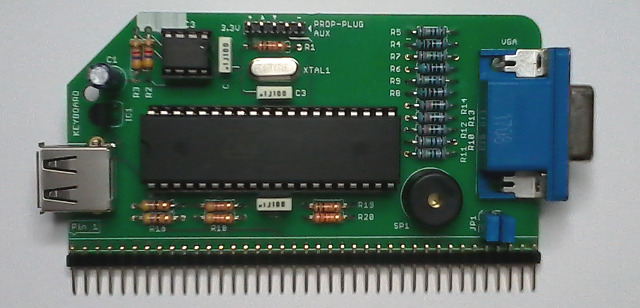
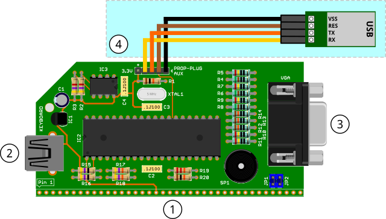
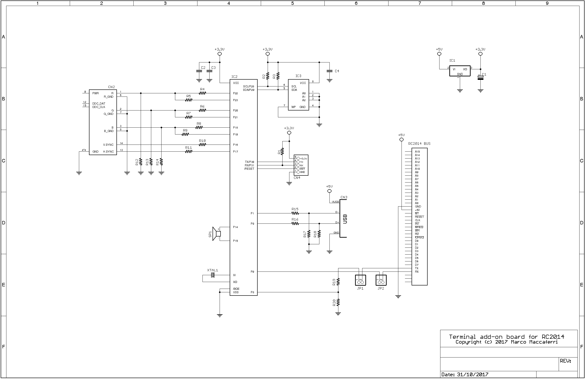

## Propeller ANSI / VT-100 Terminal

Firmware for a serial terminal add-on board designed for the [RC2014](http://http://rc2014.co.uk/) computer. It adds VGA video output as
80x25 text (640x400@70Hz) with ANSI / VT-100 terminal emulation, and USB keyboard input. Using a single
[Parallax Propeller](https://www.parallax.com) microcontroller running at 80MHz.



### Connections



 1. RC2014 bus
 2. USB Keyboard
 3. VGA
 4. Programming header (optional prop-plug compatible)

**JP1** and **JP2** can be used to disconnect the board from the standard RX and TX lines on the bus and connect to another serial port (for example to the secondary
port of the dual serial board). Use the top pads to connect the RX and TX lines respectively.

The **USB** host driver supports __keyboards only__, no other devices are supported including hubs.

The programming header can be used as an auxiliary serial input, all characters received are sent to the RC2014 as they were typed by the user.
Beware that __the port levels are 3.3 volts only__.

### Firmware compile

The firmware can be compiled using [OpenSpin](https://www.maccasoft.com/downloads/) and uploaded to the EEPROM either using the Prop-Plug serial adapter for in-circuit programming
or a stand alone programmer.

Compile with the following command:

`openspin -b -u -DKEYMAP_IT vt100.spin`

The -DKEYMAP_IT parameter specifies the keyboard layout mapping, replace the last two letters (IT) with the country code you want to compile. The currently available
countries are DE (Germany), FR (France, QZERTY), IT (Italy), NO (Norway), UK (United Kingdom) and US (United States).

The compiler generates a file named vt100.binary that can be written to the EEPROM using a stand alone programmer.

**In-circuit programming**

The firmware can also be written to the EEPROM using a Prop-Plug serial adapter connected to the board using the programming header as illustrated on the picture above
(be sure to connect the cables properly, the leftmost pin marked 3.3v is not used with the Prop-Plug adapter).

Download the [Propeller Loader](https://www.maccasoft.com/downloads/) tool, connect the adapter to a USB port and issue the following command:

`propeller-load -p /dev/ttyUSB0 -e -r vt100.binary`

The -p parameter specifies the serial port assigned to the Prop-Plug adapter in the notation used by the operating system (/dev/ttyUSBx for Linux, COMxx for Windows).

After programming the board is reset and the new firmware immediately usable.

### Terminal ANSI Codes

The following escape sequences can be used to control the terminal behaviour

 * **`\ESC[{COUNT}A`**  
       Moves the cursor up by COUNT rows; the default count is 1.  
 * **`\ESC[{COUNT}B`**  
       Moves the cursor down by COUNT rows; the default count is 1.  
 * **`\ESC[{COUNT}C`**  
       Moves the cursor forward by COUNT columns; the default count is 1.  
 * **`\ESC[{COUNT}D`**  
       Moves the cursor backwards by COUNT columns; the default count is 1.  
 * **`\ESC[{ROW];{COLUMN}H`**  
       Sets the cursor position where subsequent text will begin. If no ROW/COLUMN parameters
       are provided (ie. `\ESC[H`), the cursor will move to the home position, at the upper left
       of the screen.  
 * **`\ESC[K`**  
       Clear line from cursor right.  
 * **`\ESC[1K`**  
       Clear line from cursor left.  
 * **`\ESC[2K`**  
       Clear entire line.  
 * **`\ESC[J`**  
       Clear screen from cursor down.  
 * **`\ESC[1J`**  
       Clear screen from cursor up.  
 * **`\ESC[2J`**  
       Clear entire screen.  
 * **`\ESC[{ROW];{COLUMN}f`**  
       Same as `\ESC[{ROW];{COLUMN}H`.  
 * **`\ESC[{NUM1};...;{NUMn}m`**  
       Sets multiple display attribute settings. The following lists supported attributes:  
        **`0`** - Reset all attributes  
        **`1`** - Bright  
        **`2`** - Dim  
        **`5`** - Blink  
        **`7`** - Reverse  
        **`25`** - Blink off  
        **`30..37`** - Foreground color (black, red, green, yellow, blue, magenta, cyan, white)  
        **`38;5;{NUM}`** - Foreground color to {NUM} (0-15)  
        **`39;{NUM}`** - Default foreground color  
        **`40..47`** - Background color (black, red, green, yellow, blue, magenta, cyan, white)  
        **`48;5;{NUM}`** - Background color to {NUM} (0-7)  
        **`49;{NUM}`** - Default background color  
 * **`\ESC[6n`**  
       Reports the cursor position to the application as (as though typed at the
       keyboard) `\ESC[{ROW];{COLUMN}R`  
 * **`\ESC[s`**  
       Save current cursor position.  
 * **`\ESC[u`**  
       Restores the saved cursor position.  
 * **`\ESC[?1h`**  
       Set cursor keys to application (WS-compatible).  
 * **`\ESC[?1l`**  
       Set cursor keys to cursor.  
 * **`\ESC[?12h`**  
       Enable cursor blinking.  
 * **`\ESC[?12l`**  
       Disable cursor blinking.  
 * **`\ESC[?25h`**  
       Show cursor.  
 * **`\ESC[?25l`**  
       Hide cursor.  
 * **`\ESC[{NUM}q`**  
       Set cursor style. {NUM} is 0/1=blinking block, 2=steady block, 3=blinking underline, 4=steady underline.  
 * **`\ESC[L`**  
       Insert line.  
 * **`\ESC[M`**  
       Delete line.  

Where `\ESC` is the binary character `1Bh (or 27)` and `{NUM}`, `{COUNT}`,
`{ROW}`, `{COLUMN}` is any sequence of numeric characters like `123`.

### Usage from BASIC

```
10 PRINT CHR$(27);"[1;31m";"TEXT IN RED";CHR$(27);"[0m"
```

### Schematic



| Parts List |  |
| --- | --- |
| R1 = 10.000 ohm 1/4 watt| R19 = 10.000 ohm 1/4 watt|
| R2 = 4.700 ohm 1/4 watt| R20 = 22.000 ohm 1/4 watt|
| R3 = 4.700 ohm 1/4 watt| C1 = 10 uF 63v elettr.|
| R4 = 510 ohm 1/4 watt 1%| C2 = 100.000 pF poly.|
| R5 = 240 ohm 1/4 watt 1%| C3 = 100.000 pF poly.|
| R6 = 510 ohm 1/4 watt 1%| C4 = 100.000 pF poly.|
| R7 = 240 ohm 1/4 watt 1%| XTAL1 = 5 MHz crystal|
| R8 = 510 ohm 1/4 watt 1%| IC1 = MCP1700-3302E/TO|
| R9 = 240 ohm 1/4 watt 1%| IC2 = P8X32A-D40|
| R10 = 240 ohm 1/4 watt 1%| IC3 = 24LC256|
| R11 = 240 ohm 1/4 watt 1%| SP1 = Piezoelectric buzzer|
| R12 = 130 ohm 1/4 watt 1%| JP1 = 2 pin male header|
| R13 = 130 ohm 1/4 watt 1%| JP2 = 2 pin male header|
| R14 = 130 ohm 1/4 watt 1%| CN1 = USB-A connector|
| R15 = 47 ohm 1/4 watt| CN2 = 40 pin male header, right angle|
| R16 = 47 ohm 1/4 watt| CN3 = DB15 HD female connector|
| R17 = 47.000 ohm 1/4 watt| CN4 = 5 pin male header|
| R18 = 47.000 ohm 1/4 watt| |

Board shared on [OSHPark](https://oshpark.com/shared_projects/Utghpucg) and available on [Tindie](https://www.tindie.com/stores/maccasoft/).

